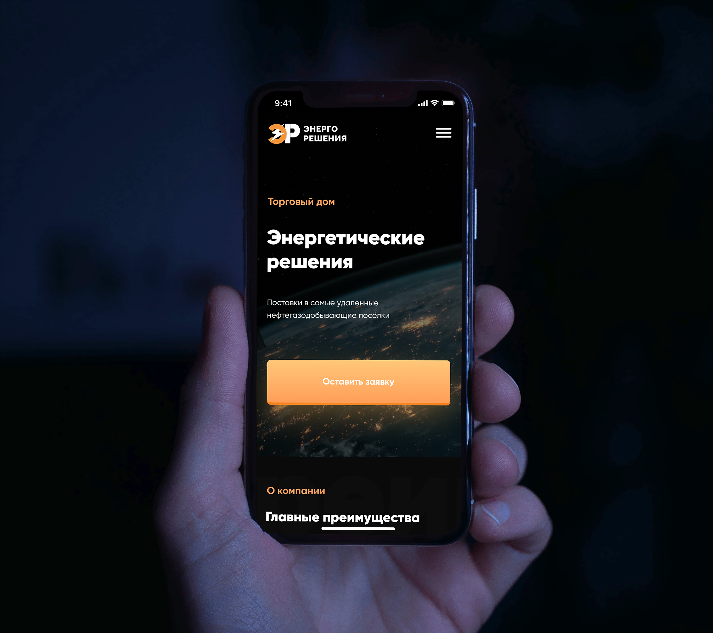

<h1>Верстка многостраничного сайта для компании ГК Энергетические решения и посадка на MODX CMF</h1>

<h2>Как запустить проект</h2>

<pre>git clone https://github.com/jokeejoke/td-energeticheskie-reweniya.git</pre>

<ol>
	<li>Клонировать репозиторий из GitHub</li>
	<li>Установить Node Modules: <strong>npm i</strong></li>
	<li>Запустить проект: <strong>gulp</strong></li>
</ol>
